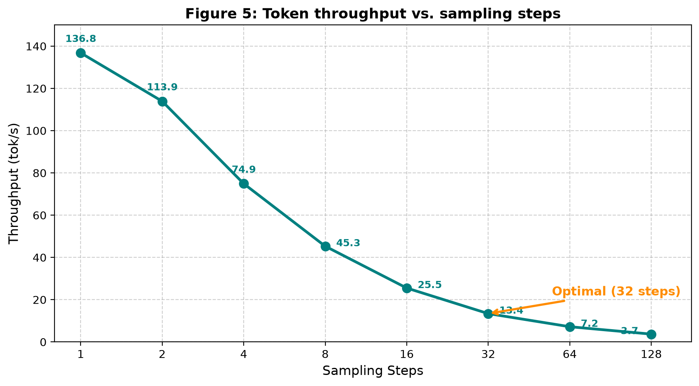
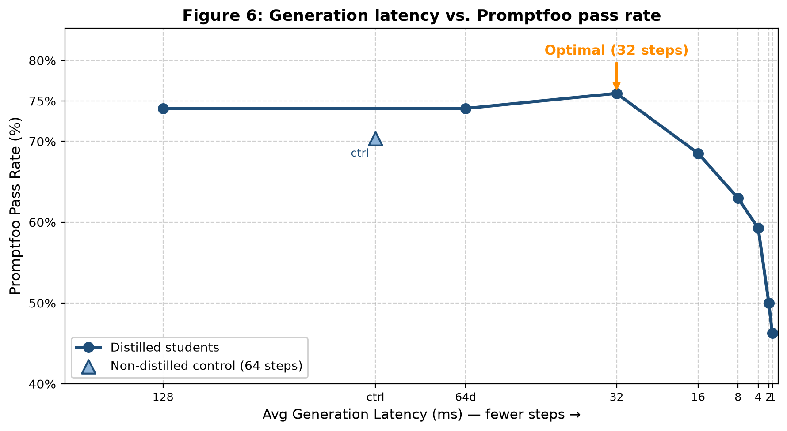

# FAST PARALLEL TOKEN INFERENCE WITH LANGUAGE DIFFUSION MODELS

**Bachelor's Thesis (TFG)**  
Author: Albert GoTri

## Project Summary

This repository contains the complete source code, trained adapter checkpoints, and evaluation scripts for *Progressive Distillation for Language Diffusion Models*, a reproducible pipeline that adapts **Progressive Distillation** — originally developed for continuous image-diffusion models — to the discrete token domain of **Language Diffusion Models (LDMs)**.

The central contribution is a full end-to-end distillation pipeline that compresses the inference step count of **LLaDA-8B-Instruct** from 128 denoising steps down to a single step through seven recursive teacher–student distillation rounds. The entire pipeline runs entirely on a single consumer GPU with 8 GB VRAM.

The core technical challenge is the absence of a continuous interpolation space in the discrete setting: unlike image diffusion, where the teacher’s two-step output is a real-valued vector usable as a regression target, text tokens are categorical. This work resolves the challenge by formulating distillation as a **KL divergence minimization** over the teacher's soft vocabulary distributions, cached offline from intermediate denoising trajectories, and paired with parameter-efficient **LoRA fine-tuning** to keep the pipeline within consumer VRAM constraints.

## Results

### Table 7 — Language Quality Metrics

The table below compares the 128-step Teacher baseline, the 64-step non-distilled control, and all seven progressively distilled Students. Perplexity (PPL) is computed via a GPT-2 reference model on generated outputs (lower is better); the Promptfoo pass rate is the fraction of semantic assertions that passed an LLM-as-a-Judge evaluation.

| Model Variant | Steps | Promptfoo Pass Rate | Avg Perplexity |
|:---|:---:|:---:|:---:|
| **Teacher Baseline** | 128 | 74.07% | 13.00 |
| Teacher Control (no LoRA) | 64 | 70.37% | 17.38 |
| Distilled Student (Round 1) | 64 | 74.07% | 12.97 |
| **Distilled Student (Round 2)** | **32** | **75.93%** | **15.93** |
| Distilled Student (Round 3) | 16 | 68.52% | 24.86 |
| Distilled Student (Round 4) | 8 | 62.96% | 68.44 |
| Distilled Student (Round 5) | 4 | 59.26% | 79.18 |
| Distilled Student (Round 6) | 2 | 50.00% | 161.93 |
| Distilled Student (Round 7) | 1 | 46.30% | 353.26 |

#### Key Findings

- **Round 1** (64 steps) exactly matches the 128-step Teacher on both Promptfoo pass rate (74.07%) and perplexity (12.97), while running **1.94× faster**.
- **Round 2** (32 steps) achieves the optimal quality–speed trade-off: it is **3.63× faster** than the Teacher, **surpasses** its Promptfoo pass rate (75.93% vs. 74.07%), and maintains a perplexity of 15.93 — comfortably within the 1.5× envelope relative to the Teacher baseline of 13.00.
- The 64-step **non-distilled control** degrades to 70.37% pass rate and 17.38 perplexity, confirming that naive step reduction *without* distillation incurs meaningful quality erosion.
- Below 16 steps, perplexity rises super-exponentially, marking the practical lower bound for this architecture and hardware configuration.

### Figure 5 — Token Throughput vs. Sampling Steps



*Figure 5: Token throughput (tok/s) vs. sampling steps, derived from serial, single-GPU latency measurements on an NVIDIA RTX 2070 Super. The curve is concave because fixed per-step overhead (CUDA kernel launches, block scheduling, sampling bookkeeping) dominates at very low step counts, making each additional step reduction yield diminishing absolute latency savings. The 32-step operating point (orange) delivers 13.4 tok/s — a 3.6× improvement over the 128-step Teacher — while retaining the highest measured Promptfoo pass rate.*

### Supplementary Result — Quality vs. Latency Trade-off

For completeness, the figure below visualizes the quality–latency trade-off that underpins the choice of the 32-step operating point:



*Figure 6: Generation latency vs. Promptfoo pass rate. The 32-step distilled Student achieves the highest pass rate (75.93%) while running 3.63× faster than the 128-step Teacher. Quality degrades sharply below 16 steps.*

### Speed-up Summary

| Steps | Avg Speedup | Avg Latency (ms) | Throughput (tok/s) |
|---:|:---:|---:|---:|
| 128 | 1.00× | 17,292 | 3.7 |
| 64 | 1.94× | 8,934 | 7.2 |
| **32** | **3.63×** | **4,766** | **13.4** |
| 16 | 6.88× | 2,514 | 25.5 |
| 8 | 12.25× | 1,412 | 45.3 |
| 4 | 20.22× | 855 | 74.9 |
| 2 | 30.77× | 562 | 113.9 |
| 1 | 36.95× | 468 | 136.8 |

## How to Run the Code

### Prerequisites

- **OS:** Windows 11 (tested). Linux should work with minor path adjustments.
- **GPU:** NVIDIA GPU with ≥ 8 GB VRAM (tested on RTX 2070 Super).
- **System RAM:** ≥ 32 GB recommended.
- **Python:** 3.10+

### Installation

1. Clone the repository and navigate to the root folder.
2. Install the required dependencies:

```bash
pip install -r requirements.txt
```

Key packages:
- PyTorch 2.5.1 (CUDA 12.1)
- Transformers 4.46.3
- PEFT 0.18.1 (LoRA adapters)
- Datasets 4.8.4
- bitsandbytes 0.49.2 (4-bit quantization)
- Flask 3.1.3 (inference server)

> **Note:** The `nested_distillation.py` pipeline also requires [Ollama](https://ollama.com/) for the local judge model (Llama 3.1 8B) used in Promptfoo evaluation.

### Main Pipeline — End-to-End Nested Distillation

The simplest way to reproduce the full pipeline is to run the top-level orchestrator:

```bash
python nested_distillation.py
```

This executes the complete recursive teacher–student distillation chain (`128 → 64 → 32 → 16 → 8 → 4 → 2 → 1` steps), automatically alternating between **teacher trajectory caching**, **student training** (LoRA adapter fine-tuning), and **evaluation** (Promptfoo + perplexity) for each round.

Other useful flags:

```bash
python nested_distillation.py --config custom_config.yaml  # Use a custom configuration
python nested_distillation.py --resume                       # Resume an interrupted run
python nested_distillation.py --dry-run                      # Preview planned execution without running
python nested_distillation.py --status                       # Check pipeline status
```

The default configuration is located at `LLaDA/nested_distillation_config.yaml`, where you can adjust:
- Model path and initial teacher steps
- LoRA rank, alpha, target modules, and dropout
- Distillation temperature, learning rate, batch size
- Dataset, evaluation thresholds, and output directories

### Local Distillation (Step-by-Step)

For finer-grained control, or if you only want to run a single distillation round, use the local scripts inside the `LLaDA/` folder:

1. **Cache Teacher Trajectories**
   ```bash
   cd LLaDA
   python 01_cache_teacher.py
   ```
   Generates teacher diffusion trajectories and caches intermediate states as compressed `.pt` bundles.

2. **Train the LoRA Student**
   ```bash
   python 02_train_student.py
   ```
   Trains a LoRA-adapted student via KL divergence against the cached teacher logits.

3. **Evaluate Locally**
   ```bash
   python run_llada_local.py
   ```
   Runs generation inference on the fine-tuned LoRA student or the foundation model.

> Full instructions are also available in `LLaDA/LOCAL_DISTILLATION_INSTRUCTIONS.md`.

### Inference & Serving

Launch the Flask evaluation server:

```bash
cd LLaDA
python serve_llada.py
```

Or use the managed server wrapper (integrated with the evaluation framework):

```bash
python nested_distillation_server.py
```

### Evaluation Metrics

- **Promptfoo** — Assertion-level semantic quality assessment (54 assertions across 12 prompts) using Llama 3.1 8B as a local judge.
- **Perplexity** — GPT-2 language-model coherence baseline.
- **Latency / Throughput** — Measured server-side via the Flask endpoint (serial, single-GPU).

## Repository Structure

```
├── nested_distillation.py              # Main end-to-end pipeline orchestrator
├── requirements.txt                    # Python dependencies
├── LLaDA/                              # Core library and scripts
│   ├── nested_distillation_config.yaml # Default experiment configuration
│   ├── generate.py                     # LLaDA generation utilities
│   ├── generate_cache.py               # Teacher trajectory caching
│   ├── nested_distillation_eval.py     # Evaluation framework
│   ├── nested_distillation_server.py   # Managed Flask server
│   ├── nested_distillation_utils.py    # Utilities & state management
│   ├── run_llada_local.py              # Local evaluation script
│   ├── serve_llada.py                  # Standalone inference server
│   ├── 01_cache_teacher.py             # Step 1: Cache teacher trajectories
│   ├── 02_train_student.py             # Step 2: Train LoRA student
│   └── LOCAL_DISTILLATION_INSTRUCTIONS.md
├── thesis/                             # LaTeX thesis source and PDF
│   ├── fast_token_inference_language_diffusion.pdf
│   └── annex_reports/                  # Evaluation reports (per round)
├── actionable_results/                 # Experimental outputs and checkpoints
└── figures/                            # Reproduced result figures
```

